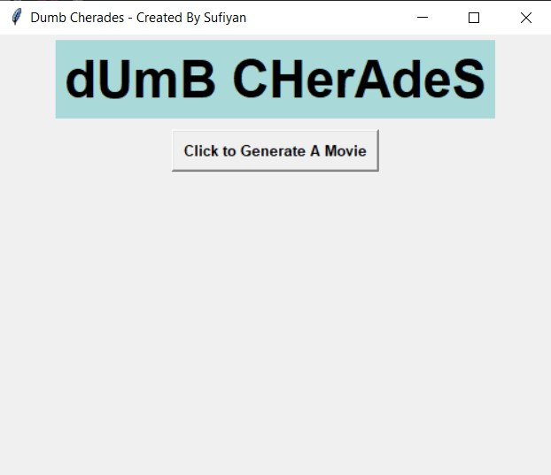
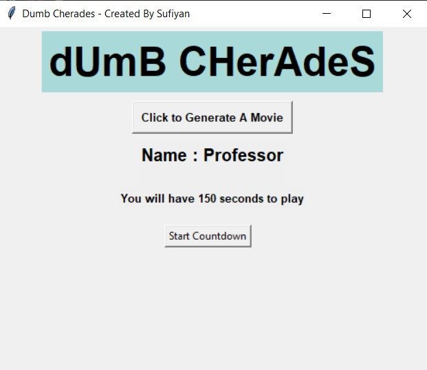
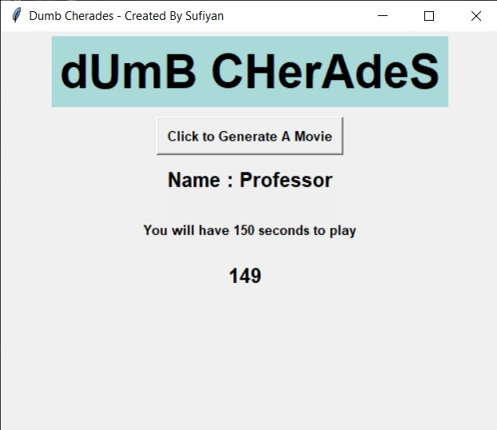
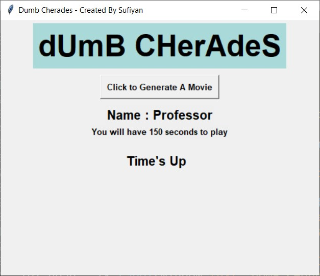

# Dumb Sheraz

The classic game of making others guess the name of movies using body language.

### Files
- main.py
	- this is the [source code](https://github.com/suffisme/DumbSheraz) of the program
- movies.txt
	- This contains the list of names of movies, you can add/delete/edit this file as per your convinience

### Running the file
- make sure to have python installed

### Modules Used
- tkinter
- tkinter.font
- time
- random

Note: python3 is required

### Screenshots
- Homepage

- Generating Movie Name

- Starting Countdown

- Time's Up

